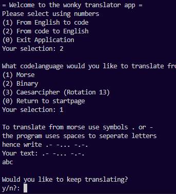

# Vision och kravspecifikation
Syftet med denna applikation, var att bygga en app som använder sig utav min modul [code-translator](https://github.com/steiboldt/code-translator)

## Kravspecifikation

### Funktionella krav
* Som en slutanvändare vill jag navigera i appen via terminalen.
* Som en slutanvändare vill jag få välja att antingen översätta från engelska eller från kodspråk
* Som en slutanvändare vill jag att när jag ska översätta från engelska, få skriva in en sträng som jag sedan kan använda igen för att översätta till ett annat kodspråk.
* Som en slutanvändare vill jag kunna översätta från de olika kodspråken till engelska. 

### Icke-funktionella krav
* Applikationen ska vara enkel att använda.

## Testrapport
### Hur jag testat
Jag har använt mig av manuella tester

| User cases| Testmetod | Status|       
| --------- |:---------:|:-----:|
| UC 1    | Manuell   |✅ |
| UC 2    | Manuell   |✅ |
| UC 3    | Manuell   |✅ |
| UC 4    | Manuell   |✅ |

## Förberedelser 
* Installera appen enligt instruktioner i README.md

## UC1 - Terminal
Beskrivning: Kontrollera att applikationen visar terminalmenyn som förväntat.

### Instruktion
1. Starta applikationen via `npm start`
2. Navigera i menyn via terminalen.

**Förväntat utfall**

## UC2 - Välja språk
Beskrivning: Kontrollera att applikationen visar terminalvalen som förväntat.

### Instruktion
1. Starta applikationen via `npm start`
2. Navigera i menyn via terminalen.

**Förväntat utfall**

## UC3 - Återanvända sträng 
Beskrivning: Kontrollera att använda samma sträng att översätta till flera kodspråk

### Instruktion
1. Starta applikationen via `npm start`
2. Navigera i menyn via terminalen.
3. Översätta engelska "hello world" till morsekod. 
4. Sedan översätta samma sträng till binärt.

**Förväntat utfall**

## UC4 - Översätta från de olika kodspråken
Beskrivning: Använda appliktationen för att översätta från de olika kodspråken

### Instruktion
1. Starta applikationen via `npm start`
2. Navigera i menyn via terminalen.
3. Översätta från de olika kodspråken

**Förväntat utfall**

