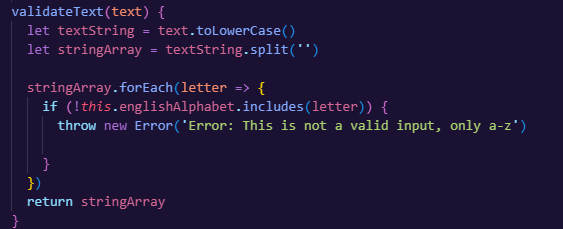
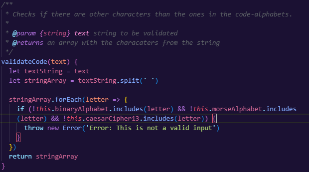
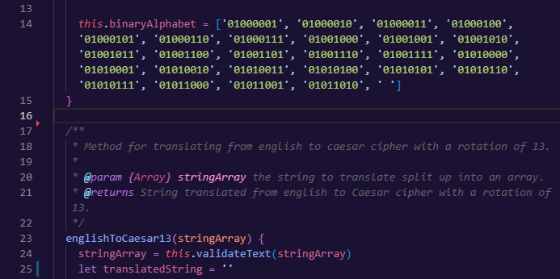
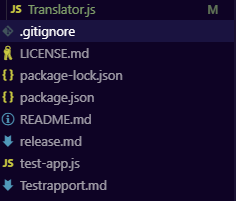
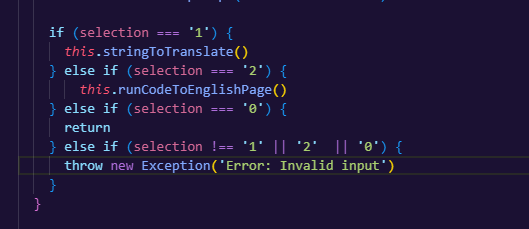
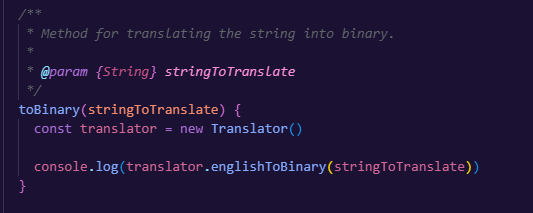
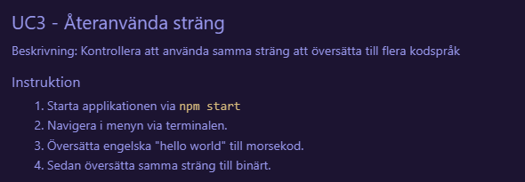
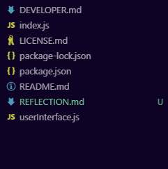
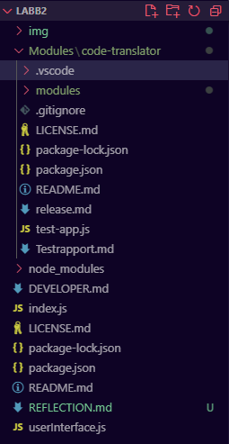

# Reflektion
Reflektioner från boken Clean Code (C. Martin, Robert. 2009. Clean Code)

## 2. Meaningful names
Vad jag har kämpat med namn sedan jag började programmera, man kan tycka att det borde vara det enklaste, men icke. Jag vet att jag personligen suttit och funderat på vad jag ska döpa en metod eller variabel till bara döpt den till "asdf()" eller liknande för att sedan gå vidare och helt glömma bort den, och när jag väl kommit tillbaka till den så har jag inte fattat vad jag skrivit. Detta i sig har varit i kombination med ett annat problem, som tas upp i Kapitel 3.

I övrigt är jag väldigt nöjd med mina namn i L1. Code Translator. De är korta, läsbara, inte för långa och jag tycker att man i kontexten av modulen förstår vad det är metoderna gör. Om man ska vara riktigt petig så har jag ett gäng variabler som heter "answer" som egentligen skulle kunna heta "translatedString". Så det ändrar jag. 

## 3. Functions
Här ligger och en av det stora utmaningarna som jag haft, och som jag väldigt aktivt tänker på. Det som ringer i huvudet är "Do one thing". Därav ofta varför jag haft problem med att sätta namn på metoder. Metoderna var alldeles för stora och gjorde massvis med saker. 

Jag vet inte hur hårt jag ska ta åt denna regel, för jag kontrollerar min data innan jag utför det som ska göras på den, detta är väl egentligen 2 saker? Men vet inte hur man annars ska göra det, så här ser jag faktiskt inte jättestor anledning att uppdatera något.

## 4. Comments
Ganska ofta kan jag tycka vi skriver kommenterar bara "därför att". Även fast jag tycker att i många fall det inte behövs någon kommentar. Därav kommenterar så som "Method for translating text to binary." till metoden englishToBinary(). Här känns kommenteraren helt onödig för jag tycker att metodens namn i kontexten till modulen får en att förstå att man översätter från engelska till binärt. Sen har jag andra kommenterar som är väldigt bra, som till validateText(). Namnet är bra och man förstår att den validerar, men kanske inte hur, då tycker jag "Checks if there are other characters than the ones in the code-alphabets." är en väldigt bra kommentar. 

## 5. Formatting
Regler såsom vertical density, distance, dependent functions och conceptual affinity har jag tänkt så mycket på, då jag känner att det har varit ganska logiskt att följa dessa regler redan från början, och jag tycker att jag har gjort ett bra jobb med dessa. Det som jag absolut inte tänkt på är Vertical Formatting eller The Newspaper Metaphor. Det jag tycker jag har gjort bra är att lägga saker tillsammans på ett bra sätt, dock inte själva ordningen, validateText() och validateCode() borde ligga längst ned, inte längst upp som de gör nu. 

Se radnummer.

## 6. Objects and Data Structure
Det är svårt att inte känna sig träffad av Law of Demeter. Dess regler har jag brutit mot säkert otaliga gånger. I fallet av min L1 har jag bara 1 klass. Därav har jag inte det problemet. Nu är heller min modul inte så stor, och det som hade kunnat brytas ut är väl kanske valideringen men här är jag väldigt osäker.  

## 7. Error handling
I min applikations finns det väl bara ett sätt få fel, att in-data in i metoderna är fel, och det är därför det första jag gör i mina översättningsmetoder är att kolla om strängen uppfyller kraven för att översättas, eller att kolla efter felaktiv input i mina menyer i L2. Vilket gör det väldigt lätt att hantera felen i det här fallet. 

## 8. Boundaries
Det enda enda externa förutom min egna L1 modul som jag använt är prompt-sync, vilket jag änvänder för terminalinput. I Kapitlet boundaries lägger man mycket vikt i att testa tredjepartsberoenden. Vilket är gjort i båda L1 och L2. 

Exempel där jag använder min modul. 

## 9. Unit Tests
I detta kapitel trycks det hårt på Testdriven utveckling, och att man ska skriva tester innan man skriver någon annan kod, vilket jag definitivt inte gjort, fy skäms! Men något som jag tog till mig var just clean tests. "readability, readibility and readability" tillsammans med "In a test you want to say a lot with as few expressions as possible", och det var just det jag var ute efter när jag skrev testerna, men samtidigt testa all viktig funktionalitet i applikationen. 

## 10. Classes
Ett återkommande koncept i boken är just "small", det är även sant för Kapitel 10 Classes. Enligt boken skall de inte vara mer än 500 rader per klass, vilket jag inte når upp till, jag har inte heller mer än 1 klass. Under projektets gång har jag varit kluven i hur jag ska göra, jag ville ha fler klasser. Men visste inte vad jag skulle ha enskilda klasser åt. Tillslut kom jag väl fram till att problemet låg i storleken och komplexiteten i min applikation.

## 11. Systems
Sista kapitlet har jag med ärlighet haft svårt att få grepp om. Men det jag funderat på är "How would you build a city?", och som någon som ofta hänger upp sig i uppstarten av ett projekt. Så har jag verkligen inget bra svar. Sen är det frågan om att skala upp projektet. Givetvis går det att implementera flera kodspråk. Men vad annars skulle det går att skala upp det till? Min applikation är av natur ganska simpel och jag har svårt att vidga vyerna. 

